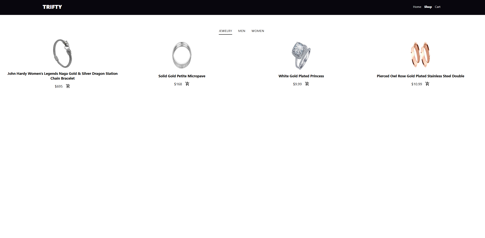

# The Odin Project - Shopping Cart

This is a react practice from the odin project which leverages the use of states and fetching of api. Also practice testing



## Stack

- React
- Jest React Test
- Fake Api - [docs](https://fakestoreapi.com/docs)


## Get Started

```
npm install
npm run dev
```

for testing
```
npm test
```